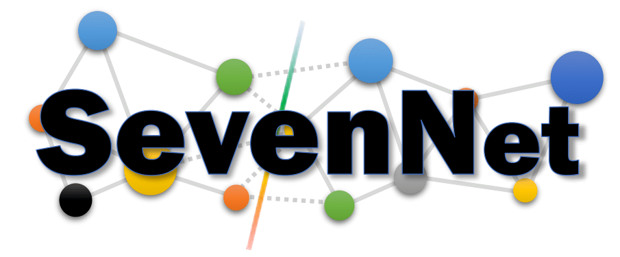

# SevenNet-reEWC

SevenNet (Scalable EquiVariance Enabled Neural Network) is a graph neural network interatomic potential package that supports parallel molecular dynamics simulations with [`LAMMPS`](https://docs.lammps.org/Manual.html). Its underlying GNN model is based on [`nequip`](https://github.com/mir-group/nequip).

SevenNet-reEWC provides a fine-tuning framework that combines Experience Replay (implemented under the name rehearsal in the code) and Elastic Weight Consolidation (EWC).

The current version is 0.9.5, and it is planned to be merged into the main SevenNet codebase in the future.

Example inputs are available in the example_inputs directory.
